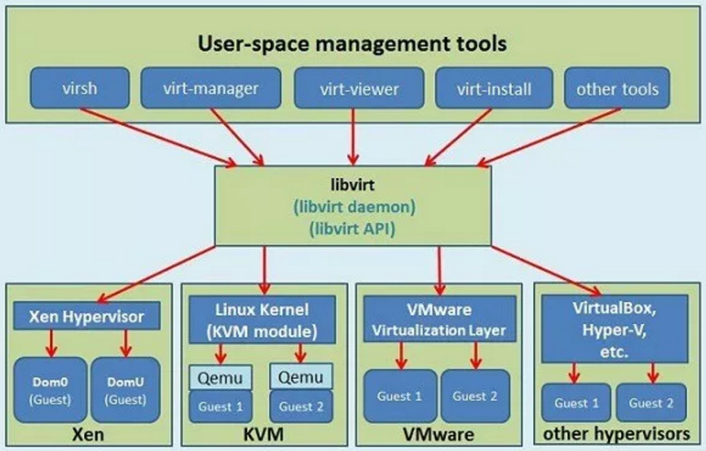
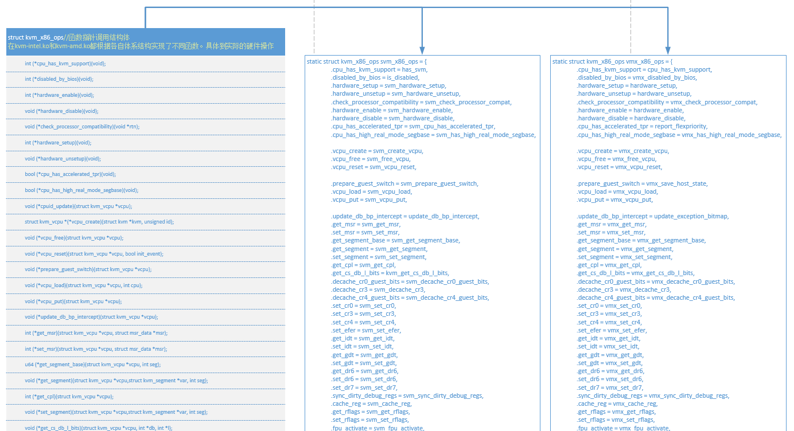
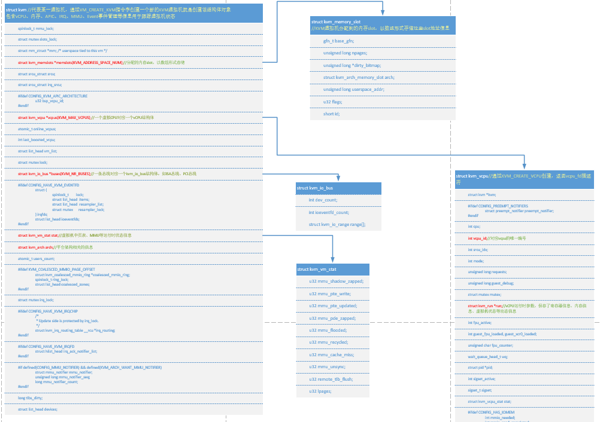
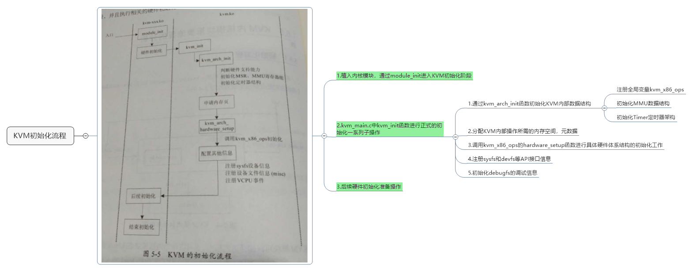
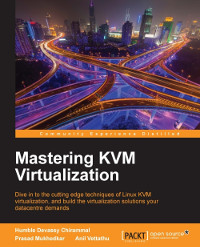

# KVM学习笔记

## 仓库介绍

本参考主要内容为KVM相关知识的学习笔记，可以打开相应GitBook站点阅读。

```
Something I hope you know before go into the coding~
First, please watch or star this repo, I'll be more happy if you follow me.
Bug report, questions and discussion are welcome, you can post an issue or pull a request.
```

## 相关站点

* GitBook访问地址：<https://yifengyou.gitbooks.io/learn-kvm/content/>
* GitHub访问地址：<https://github.com/yifengyou/learn-kvm>

## 目录

* [虚拟化技术简介](docs/虚拟化技术简介/虚拟化技术简介.md)
* [虚拟化实现技术](docs/虚拟化实现技术/虚拟化实现技术.md)
* [Intel硬件虚拟化技术](docs/Intel硬件虚拟化技术/Intel硬件虚拟化技术.md)
* [AMD硬件虚拟化技术](docs/AMD硬件虚拟化技术/AMD硬件虚拟化技术.md)
* [Xen虚拟化技术](docs/Xen虚拟化技术/Xen虚拟化技术.md)
* [Lguest虚拟化技术](docs/Lguest虚拟化技术/Lguest虚拟化技术.md)
* [KVM简介](docs/KVM简介/KVM简介.md)
* [KVM基本结构](docs/KVM基本结构/KVM基本结构.md)
* [KVM工作原理](docs/KVM工作原理/KVM工作原理.md)
* [构建KVM环境](docs/构建KVM环境/构建KVM环境.md)
* [KVM核心基础功能](docs/KVM核心基础功能/KVM核心基础功能.md)
    * [Qemu-KVM基本格式](docs/KVM核心基础功能/Qemu-KVM基本格式.md)
    * [Qemu-KVM网络配置](docs/KVM核心基础功能/Qemu-KVM网络配置.md)
    * [Qemu-KVM图形界面](docs/KVM核心基础功能/Qemu-KVM图形界面.md)
* [KVM高级功能](docs/KVM高级功能/KVM高级功能.md)
* [KVM内核模块源码分析](docs/KVM内核模块源码分析/KVM内核模块源码分析.md)
    * [kernel-2.6-KVM源码目录树分析](docs/KVM内核模块源码分析/kernel-2.6-KVM源码目录树分析.md)
    * [kernel-4.2-KVM源码目录树分析](docs/KVM内核模块源码分析/kernel-4.2-KVM源码目录树分析.md)
    * [KVM源码分析-基本工作原理](docs/KVM内核模块源码分析/KVM源码分析-基本工作原理.md)
    * [KVM的初始化流程](docs/KVM内核模块源码分析/KVM的初始化流程.md)
    * [KVM源码分析-虚拟机的创建与运行](docs/KVM内核模块源码分析/KVM源码分析-虚拟机的创建与运行.md)
    * [KVM源码分析-CPU虚拟化](docs/KVM内核模块源码分析/KVM源码分析-CPU虚拟化.md)
* [KVM开源社区](docs/KVM开源社区/KVM开源社区.md)


## KVM相关站点

* Kernel Virtual Machine:<http://www.linux-kvm.org/page/Main_Page>
* KVM早起源码pkgs:<https://src.fedoraproject.org/lookaside/pkgs/qemu/>
* SourceForge KVM页:<https://sourceforge.net/projects/kvm/>
* Qemu社区:<https://www.qemu.org>
* kvm.git:<https://git.kernel.org/pub/scm/virt/kvm/kvm.git/>

## KVM历史大事件

* 2005年11月，Intel发布奔腾四处理器第一次正式支持VT技术
* 2006年5月，AMD发布支持AMD-V处理器。
* KVM虚拟机最初是由一个以色列的创业公司Qumranet开发的，作为他们的VDI产品的虚拟机。为了简化开发，KVM的开发人员并没有选择从底层开始新写一个Hypervisor，而是选择了基于Linux kernel，通过加载新的模块从而使Linux Kernel本身变成一个Hypervisor。
* 2006年8月，在先后完成了基本功能、动态迁移以及主要的性能优化之后，Qumranet正式对外宣布了KVM的诞生并推向Linux内核社区。同年10月，KVM模块的源代码被正式接纳进入Linux Kernel，成为内核源代码的一部分。
* 2007年2月发布的Linux 2.6.20是第一个带有KVM模块的Linux内核正式发布版本。
* 2008年9月4日，同内核社区保持着很深渊源的著名Linux发行版提供商—Redhat公司出人意料地出资1亿700百万美金，收购了Qumranet，从而成为了KVM开源项目的新东家，投入较多资源在KVM虚拟化开发中。
* 2010年11月，Redhat公司推出了新的企业版Linux—RHEL 6，在这个发行版中集成了最新的KVM虚拟机，而去掉了在RHEL 5.x系列中集成的Xen。KVM成为RHEL默认的虚拟化方案


## 国内云团队

* 阿里云
* 腾讯云
* 盛大云
* 新浪SAE
* 百度BAE

## 常用概念

* 虚拟机监视器VMM(Virtual Machine Monitor) = Hypervisor
* 内核同页合并(Kernel Same-page Merging,KMS)


## 思维导图





* kvm_x86_ops针对具体CPU架构进行虚拟化时的函数指针，分别对应kvm-intel.ko和kvm-amd.ko



* struct KVM 结构体唯一代表一个虚拟机




## 参考书目





## 个人的一些看法

* KVM从一开始就必须要硬件虚拟化支持。现有的源码追溯到2006年11月2号，那个时候KVM还是有以色列创业公司Qumranet研发，分成两个部分，一部分是Qemu-kvm-patch，一部分是kvm-module。

## 总结

```
  1.基础永远值得花费90%的精力去学习加强。厚积而薄发~
  2.要理解一个软件系统的真正运行机制，一定要阅读其源代码~
```
