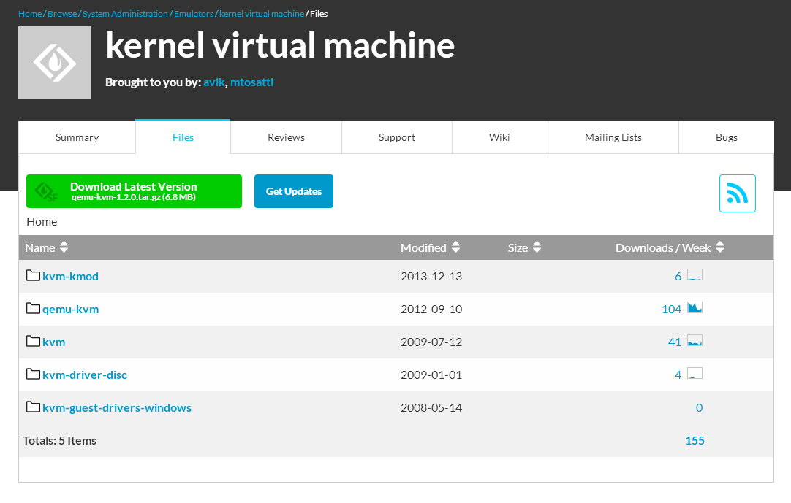
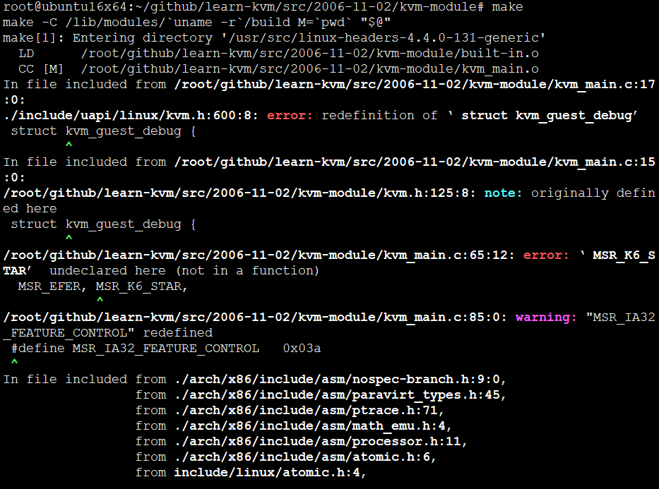
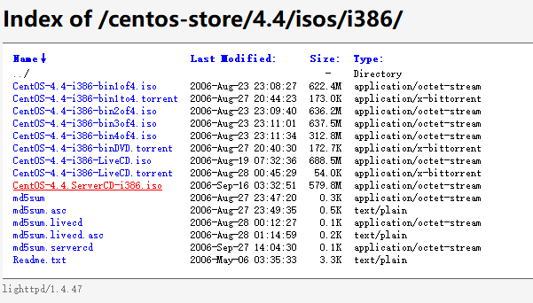

# KVM内核模块源码分析

* KVM基于内核的虚拟机 在2007年2月被导入Linux 2.6.20核心中。散步内核不同顶层目录下
    - 主要包括两个目录：virt和arch/x86/kvm
      - virt包含内核中非硬件体系架构相关的部分如IOMMU、中断控制等
      - arch/x86很明显arch就是跟体系相关。KVM不单单支持x86，还支持PowerPC、MIPS等
* 在此之前都是单模块，以色列开发人员搞得，就是个内核模块单目录

## 源码获取

下载目录:<https://sourceforge.net/projects/kvm/files/?source=navbar>



这里要分清不同目录

* kvm-kmod里面存放不同内核版本的kvm功能模块，仅包含kvm功能模块，不包含其它内核内容
* qemu-kvm其实就是支持kvm的改版qemu
* kvm是更早之前，没有加入内核模块的kvm，单独的内核模块和qemu-kvm补丁
* 剩下的两个是客户端驱动，半虚拟化用到

获取kvm目录中最早期的源码


这时候还是单模块+补丁的形式打进内核。最原始的源码，这，只能说我能找到的最原始的源码了。早期包含的源码很少，明显可以看到。找原始内核版本编译一下试试。

```
root@ubuntu16x64:~/github/learn-kvm/src/2006-11-02# tree
.
├── kvm-module
│   ├── debug.c
│   ├── debug.h
│   ├── include
│   │   └── linux
│   │       └── kvm.h
│   ├── Kbuild
│   ├── kvm.h
│   ├── kvm-kmod.spec
│   ├── kvm_main.c
│   ├── Makefile
│   ├── mmu.c
│   ├── paging_tmpl.h
│   ├── vmx.h
│   ├── x86_emulate.c
│   └── x86_emulate.h
├── kvm-module-1.tar.gz
├── libkvm
│   ├── bootstrap.lds
│   ├── emulator
│   ├── flat.lds
│   ├── kvmctl.c
│   ├── kvmctl.h
│   ├── main.c
│   ├── Makefile
│   └── test
│       ├── bootstrap.S
│       ├── cstart64.S
│       ├── cstart.S
│       ├── irq.S
│       ├── memtest1.S
│       ├── print.h
│       ├── print.S
│       ├── sieve.c
│       ├── simple.S
│       ├── stringio.S
│       ├── vm.c
│       └── vm.h
├── libkvm-1.tar.gz
└── qemu-kvm-1.patch

6 directories, 34 files
```



* 用最新的内核编译报错，这，用哪个内核版本合适呢？2006年Linux版本多少？


* 根据Makefile中的rpm判断应该是红帽系列，找个2006年的红帽子



<http://mirror.nsc.liu.se/centos-store/4.4/isos/i386/>


* 很尴尬，老版本无法编译。可能当时源码本身不完善吧。需要点技术支持。抛弃，直接上2.6.30。

找个差不多的版本就可以编译成功


##

## END
