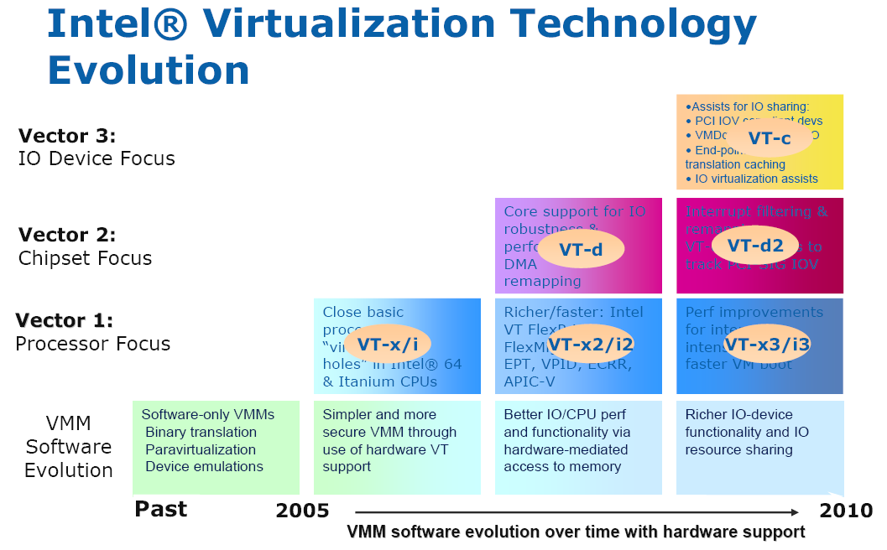

# 构建KVM环境

## 硬件系统配置要求




* 硬件必须支持Intel-VT或者AMD-V技术，并且BIOS开启虚拟化选项，不然没得玩。

## KVM 与 Qemu 的前世今生

Qemu 是一个**纯软件实现的开源「模拟」软件**，它能够模拟整套虚拟机的实现，包括 CPU、内存、各种 IO 设备、鼠标、键盘、USB 、网卡、声卡等等，基本上没有它不能模拟的。有人可能会比较疑惑它跟 KVM 之间到底有何关系，我们可以把它们看成是合作关系，好基友，谁都离不开彼此。

**KVM 离不开 Qemu**。KVM 实现初期，为了简化开发和代码重用，在 Qemu 的基础上进行了修改，主要是将比较耗性能的 CPU 虚拟化和内存虚拟化部分移到了内核中实现，保留 IO 虚拟化模块在用户空间实现。这样的做法主要是考虑到性能的原因，CPU 和 内存虚拟化是非常复杂的虚拟化模块，而且使用非常频繁，如果实现在用户空间的话，用户态和内核态的频繁切换势必会对性能造成很大的影响。那为什么要单独保留 IO 虚拟化在用户空间呢，这个也是权衡之下的结果，首先 IO 设备太多了，其次 IO 虚拟化相对其他两个模块使用不是很频繁，开销会小一些，所以，为了尽可能保持内核的纯净性，才有了这样的分配。

**Qemu 离不开 KVM**。上面也说了，Qemu 是一个纯软件的实现，运行在用户空间，性能非常低下，所以，从 Qemu 的角度，可以说是 **Qemu 使用了 KVM 的虚拟化功能，为自身虚拟机提供加速。**

早期两者还没有区分（没有同居），KVM 修改的模块叫 qemu-kvm，到 **Qemu1.3 版本之后，两者就合二为一了（同居啦）**，如果我们在用 Qemu 创建虚拟机时，**要加载 KVM 模块，需要为其指定参数 --enable-kvm。**


* KVM 是基于硬件虚拟化（**Intel VT 或 AMD-V**）实现的一套虚拟化解决方案，通过以上一个与 Qemu 关系的分析，我们基本上知道它在虚拟化领域处在一个什么样的地位。它其实只负责 CPU 和内存的虚拟化，不负责任何设备的模拟，而是提供接口给用户空间的 Qemu 来模拟。这个接口是** /dev/kvm**。
* **Qemu 通过 /dev/kvm 接口设置一个虚拟机的地址空间，然后向它提供模拟好的 I/O 设备，并将相关的设备回显操作映射到宿主机，完成整个 I/O 设备的虚拟化操作。**
* /dev/kvm 接口是 Qemu 和 KVM 交互的“桥梁”，基本的原理是：/dev/kvm 本身是一个设备文件，这就意味着可以通过 ioctl 函数来对该文件进行控制和管理，从而可以完成用户空间与内核空间的数据交互。在 KVM 与 Qemu 的通信过程主要就是一系列针对该设备文件的 ioctl 调用。

## Qemu 架构


* Qemu 是纯软件实现的虚拟化模拟器，几乎可以模拟任何硬件设备，我们最熟悉的就是能够模拟一台能够独立运行操作系统的虚拟机，虚拟机认为自己和硬件打交道，但其实是和 Qemu 模拟出来的硬件打交道，Qemu 将这些指令转译给真正的硬件。

* 正因为 Qemu 是纯软件实现的，所有的指令都要经 Qemu 过一手，性能非常低，所以，在生产环境中，大多数的做法都是配合 KVM 来完成虚拟化工作，因为 KVM 是硬件辅助的虚拟化技术，主要负责 比较繁琐的 CPU 和内存虚拟化，而 Qemu 则负责 I/O 虚拟化，两者合作各自发挥自身的优势，相得益彰。

* Qemu 可以模拟多种非当前CPU架构平台，虽然性能差，但是至少模拟的了。

**从本质上看，虚拟出的每个虚拟机对应 host 上的一个 Qemu 进程，而虚拟机的执行线程（如 CPU 线程、I/O 线程等）对应 Qemu 进程的一个线程。**

* Qemu 软件虚拟化实现的思路是采用二进制指令翻译技术，主要是提取 guest 代码，然后将其翻译成 TCG 中间代码，最后再将中间代码翻译成 host 指定架构的代码，如 x86 体系就翻译成其支持的代码形式，ARM 架构同理。


## 区分Qemu、Qemu-KVM、Linux kernel KVM

```
* Qemu1.3之后包含KVM源码。
* Qemu-kvm是修改了Qemu部分源码适配KVM
* Linux 2.6.20之后均包含KVM源码，但不包括Qemu
```

* KVM作为Linux内核模块存在，从Linux 2.6.20版本开始被正式加入内核主干开发和正式发布代码中。
* 只需要下载2.6.20之后的任意版本均包含KVM源码。

## Qemu编译安装


## 参考

aCloudDeveloper:<http://www.cnblogs.com/bakari/tag/%E8%99%9A%E6%8B%9F%E5%8C%96/>
