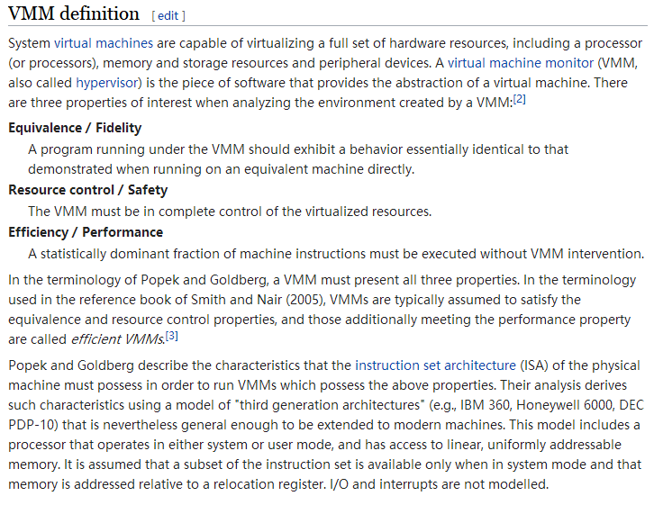

<!-- TOC depthFrom:1 depthTo:6 withLinks:1 updateOnSave:1 orderedList:0 -->

- [虚拟化实现技术](#虚拟化实现技术)
	- [系统虚拟化架构](#系统虚拟化架构)
	- [特权指令和敏感指令](#特权指令和敏感指令)
	- [Intel虚拟化](#intel虚拟化)
		- [Intel CPU虚拟化技术VT-X](#intel-cpu虚拟化技术vt-x)
		- [Intel 内存虚拟化技术EPT(Extended Page Table)扩展页表](#intel-内存虚拟化技术eptextended-page-table扩展页表)
		- [Intel CPU虚拟化技术VT-d](#intel-cpu虚拟化技术vt-d)
	- [AMD虚拟化](#amd虚拟化)
		- [AMD CPU虚拟化技术AMD SVM](#amd-cpu虚拟化技术amd-svm)
		- [AMD 内存虚拟化技术NPT(Nested Page Table)嵌套页表](#amd-内存虚拟化技术nptnested-page-table嵌套页表)
		- [AMD CPU虚拟化技术IOMMU(Input/Output Memory Management Unit)输入输出内存管理单元](#amd-cpu虚拟化技术iommuinputoutput-memory-management-unit输入输出内存管理单元)

<!-- /TOC -->

# 虚拟化实现技术

## 系统虚拟化架构

* 系统虚拟化本质就是使用虚拟化技术讲一台物理计算机虚拟为一台或多台虚拟计算机系统
* 一般而言，虚拟环境包括：硬件、VMM和虚拟机
* 没有虚拟化的情况下，os直接掌管硬件，构成完备的OS体系。当系统虚拟化时，每个虚拟机都是通过自己的虚拟硬件来提供一个独立的虚拟机执行环境。每个虚拟机认为自己独占资源，与其他虚拟机隔离，或者说其他虚拟机相对透明。实际上，是VMM抢占了物理机OS的地位，变成真实物理硬件的掌管着，向上层软件呈现出虚拟对的硬件平台。

* x86虚拟化技术中，**虚拟机监视器VMM**也叫**Hypervisor**，真实物理机叫**宿主机**，虚拟机叫**客户机**

* VMM或者说Hypervisor对物理资源的虚拟归纳为三个部分:CPU虚拟化、内存虚拟化、IO虚拟化。

* 1974年，Popek和Goldverg定义了虚拟机可以被看做是物理机的一种高效隔离的复制。包含三层含义，如图维基百科介绍的。

* 同质:虚拟机中运行与真实物理机器运行效果相同，表现上有所差异。比如虚拟机中的CPU可能必须是物理CPU兼容的一种。
* 资源受控/安全:VMM全权掌管硬件，包括资源分配回收
* 高效/性能:为了让虚拟机性能接近真实物理机，采取各种优化手段，最好的就是硬件辅助虚拟化

判断一个系统可否虚拟化的依据就是可否满足上述三条特性

## 特权指令和敏感指令

* 特权指令其实就是OS中直接和管理关键系统资源的指令
* 敏感指令就是虚拟机中操作特权资源的指令
* 特权指令都是敏感指令，但是敏感指令不一定是特权指令。
* “陷入再模拟”其实就是VMM捕获所有敏感指令，VMM模拟执行引起异常的敏感指令。
* 判断一个系统是否可虚拟化，核心就在于系统对敏感指令的支持。如果所有的敏感指令都是特权指令，则可虚拟化。如果无法支持所有的敏感指令上出发异常，则不是一个可虚拟化结构，如果霸王硬上弓，那就会存在“虚拟化漏洞”。就看你能不能捕获敏感指令了。
* 当然捕获模拟是早期的套路。之后有硬件支持，效果就好多了。填补虚拟化漏洞，并且提高性能。

## Intel虚拟化

### Intel CPU虚拟化技术VT-X

### Intel 内存虚拟化技术EPT(Extended Page Table)扩展页表

### Intel CPU虚拟化技术VT-d

## AMD虚拟化

### AMD CPU虚拟化技术AMD SVM

### AMD 内存虚拟化技术NPT(Nested Page Table)嵌套页表

### AMD CPU虚拟化技术IOMMU(Input/Output Memory Management Unit)输入输出内存管理单元
