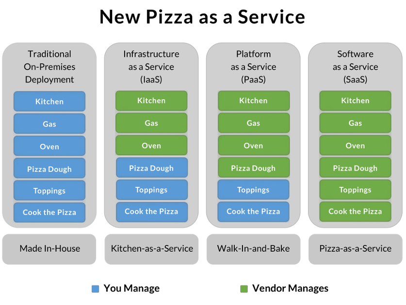
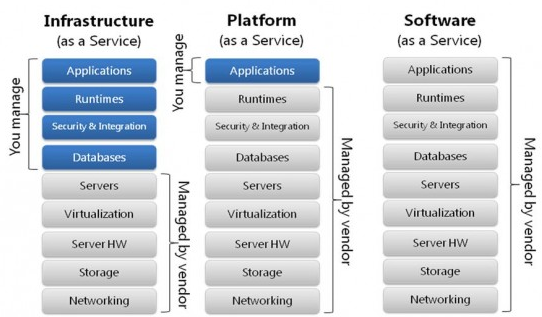

<!-- TOC depthFrom:1 depthTo:6 withLinks:1 updateOnSave:1 orderedList:0 -->

- [虚拟化技术简介](#虚拟化技术简介)
	- [云计算相关定义](#云计算相关定义)
	- [云计算模式](#云计算模式)
	- [云计算的本质](#云计算的本质)
	- [软件虚拟化](#软件虚拟化)
	- [硬件虚拟化](#硬件虚拟化)
	- [半虚拟化(Para Virtualization)](#半虚拟化para-virtualization)
	- [全虚拟化(Full Virtualization)](#全虚拟化full-virtualization)
	- [参考内容](#参考内容)

<!-- /TOC -->
# 虚拟化技术简介


## 云计算相关定义

* 维基百科云计算定义：云计算是一种通过因特网以服务的方式提供动态可伸缩的虚拟化的资源的计算模式。
* 美国国家标准与技术研究院定义云计算：云计算是一种按使用量付费的模式，这种模式提供可用的、便捷的、按需的网络访问，进入可配置的计算资源共享池（资源包括网络、服务器、存储、应用软件和服务），这些资源能够快速提供，秩序投入很少的管理工作，或与服务供应商进行很少的交互。


## 云计算模式

* 软件即服务(Software as a Service)
* 平台即服务(Platform as a Service)
* 基础设施即服务(Insfrastructure as a Service)

IBM 的软件架构师 Albert Barron 曾经使用披萨作为比喻，解释这个问题。David Ng 进一步引申，让它变得更准确易懂。请设想你是一个餐饮业者，打算做披萨生意。


方案一 IaaS

```
他人提供厨房、炉子、煤气，你使用这些基础设施，来烤你的披萨。只提供厨房煤气灶啥的，食材你自己带。
```


方案二 PaaS

```
除了基础设施，他人还提供披萨饼皮。不仅有厨房煤气灶，食材也给你准备好，就看你怎么烹饪~
```
你只要把自己的配料洒在饼皮上，让他帮你烤出来就行了。也就是说，你要做的就是设计披萨的味道（海鲜披萨或者鸡肉披萨），他人提供平台服务，让你把自己的设计实现。


方案三 SaaS

```
他人直接做好了披萨，不用你的介入，到手的就是一个成品。你要做的就是把它卖出去，最多再包装一下，印上你自己的 Logo。披萨直接给你做好，看你怎么卖，怎么吃~
```


从左到右，自己承担的工作量（上图蓝色部分）越来越少，IaaS > PaaS > SaaS。





* SaaS 是软件的开发、管理、部署都交给第三方，不需要关心技术问题，可以拿来即用。普通用户接触到的互联网服务，几乎都是 SaaS。诸如Google Apps、Fackbook、Dropbox、Twitter。
* PaaS 提供软件部署平台（runtime），抽象掉了硬件和操作系统细节，可以无缝地扩展（scaling）。开发者只需要关注自己的业务逻辑，不需要关注底层。诸如Google App Engine。
* IaaS 是云服务的最底层，主要提供一些基础资源。它与 PaaS 的区别是，用户需要自己控制底层，实现基础设施的使用逻辑。诸如AWS、Goole Compute Engine、BlueCloud。


## 云计算的本质

* 说白了就是资源充分利用，同时节省时间高效作业。由运营商提供计算服务。
* 云端的云计算系统，实质就是大型的分布式系统。虚拟化通过一个物理平台虚拟出多个虚拟平台，而其中每个虚拟平台都可以作为独立的终端加入云端的分布式系统。


## 软件虚拟化


* 虚拟化的关键一步在于，宿主机能否截获客户机直接访问硬件资源的访问请求，并且重定向到虚拟资源池中。**截获并重定向**
* Qemu 纯软件仿真X86平台处理器取指、解码和执行。客户机的指令并不在物理平台上直接执行。性能较差。但是可以模拟不同硬件平台架构。比如x86模拟mips是可以的。
* VMware的**动态二进制翻译技术**允许客户机在监控访问内让指令在物理平台上直接运行。客户机指令在运行前会经过虚拟机监视器扫描。要么检测通过并在物理平台运行，要么替换成虚拟机的软件调用，也就是模拟啦啦。性能提高，但是肯定的，不能跨硬件平台虚拟化。

## 硬件虚拟化

* 物理平台本身提供对特殊指令的**截获和重定向的硬件支持**，处理速度大大提升。
* 硬件辅助软件实现对关键硬件资源的虚拟化，从而提升性能。
* 一旦客户机试图访问物理资源，硬件就会暂停客户机的运行，控制权交给虚拟机监视器VMM处理
* 硬件虚拟化可以提供全新的架构，支持操作系统直接在上面运行，无需二进制动态翻译技术，减少了相关性能开销。简化VMM设计。
* 硬件虚拟化是一套解决方案，具体实现看具体CPU、主板芯片组、BIOS和软件支持。
* 2005年末，Intel便开始推广应用Intel Virtualization Technology（Intel VT）虚拟化技术，发布了一系列支持虚拟化的处理器。

## 半虚拟化(Para Virtualization)

## 全虚拟化(Full Virtualization)


## 参考内容

阮一峰博客:<http://www.ruanyifeng.com/blog/2017/07/iaas-paas-saas.html>
